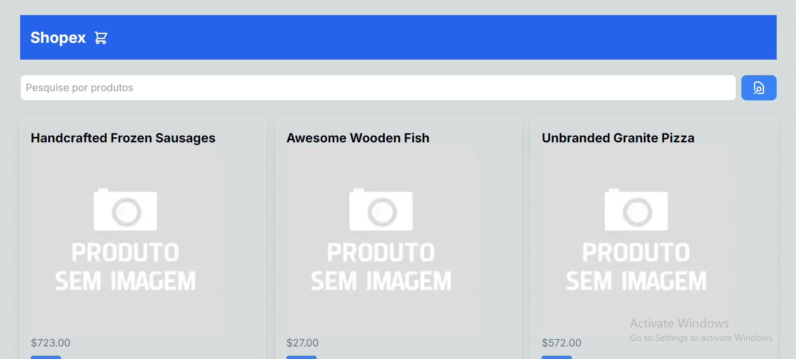
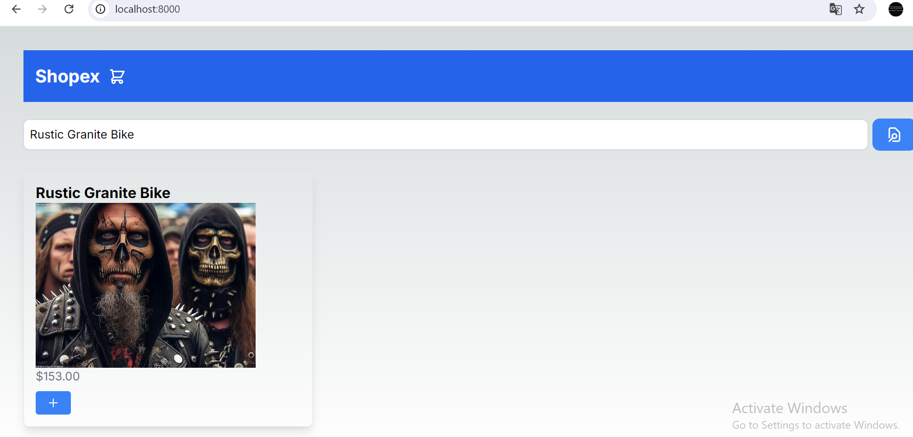
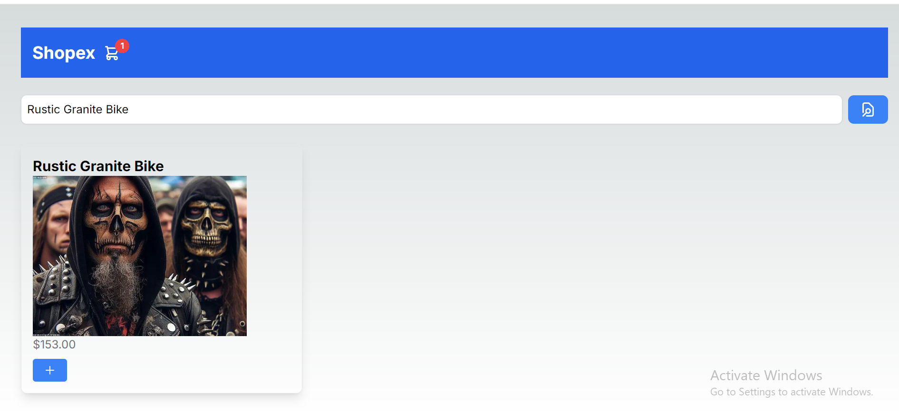
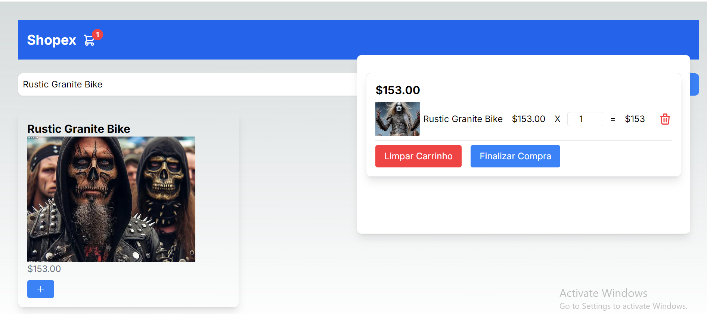
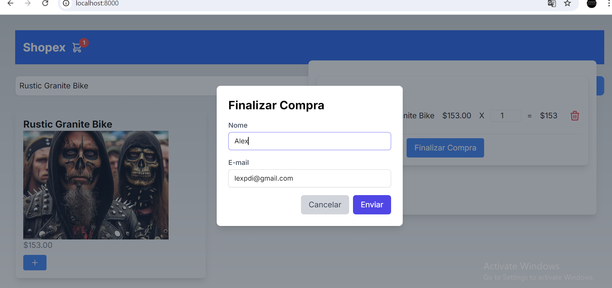
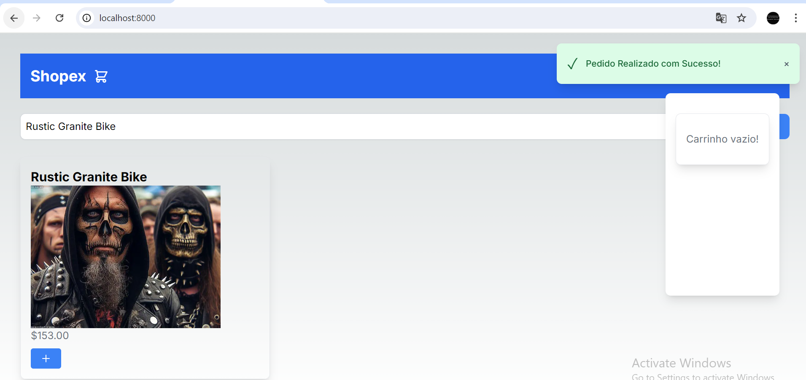

# Projeto Next.js - Shopex

Bem-vindo ao projeto Next.js! Este é um framework poderoso e flexível para construir aplicações React. Este projeto foi criado com [create-next-app](https://github.com/vercel/next.js/tree/canary/packages/create-next-app), facilitando o início com Next.js.

## 🚀 Começando

Para começar a usar o servidor de desenvolvimento, siga estes passos:

### 1. Instale as Dependências

Primeiro Certifique-se de que você tenha o [Node.js](https://nodejs.org) instalado. Em seguida, execute o comando abaixo para instalar as dependências do projeto:

```bash
npm install
# ou
yarn install
```

### 2. Inicie o Servidor de Desenvolvimento

Inicie o servidor de desenvolvimento com o comando:

```bash
npm run dev
# ou
yarn dev
```

O servidor de desenvolvimento estará ouvindo na porta `8000`. Você pode acessar sua aplicação em:

[http://localhost:8000](http://localhost:8000)

## Layout








## Mantenha-se em Contato

- **Autor:** [Alex Pereira de Oliveira](https://www.linkedin.com/in/alex-pereira-de-oliveira-628245160/)
